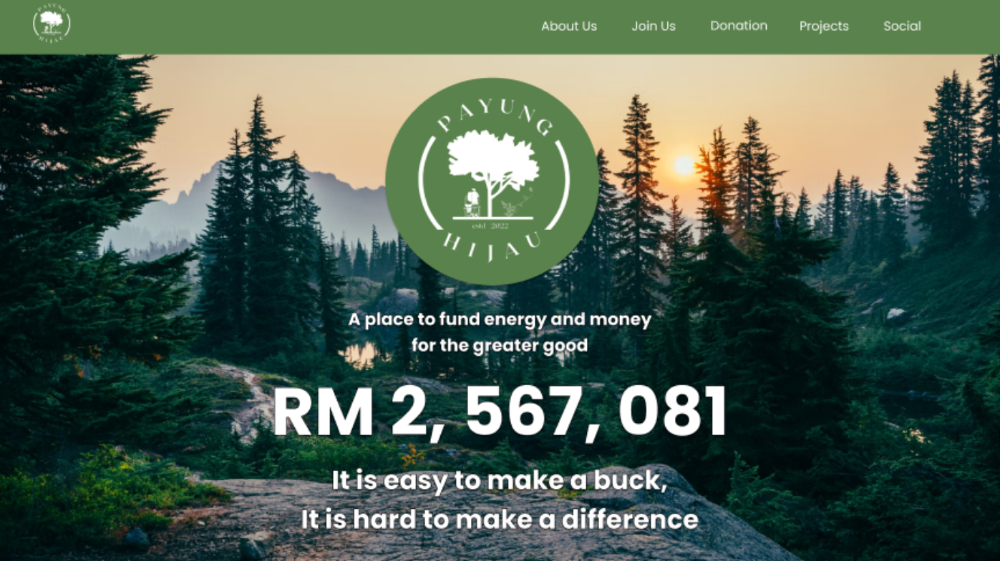
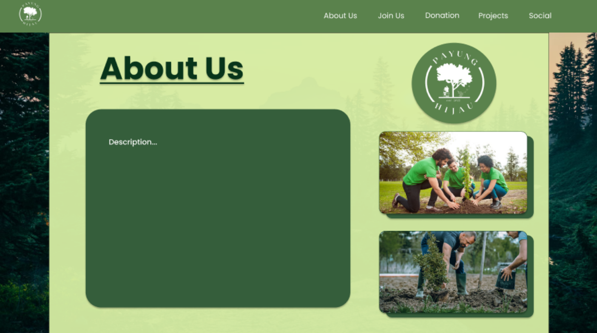
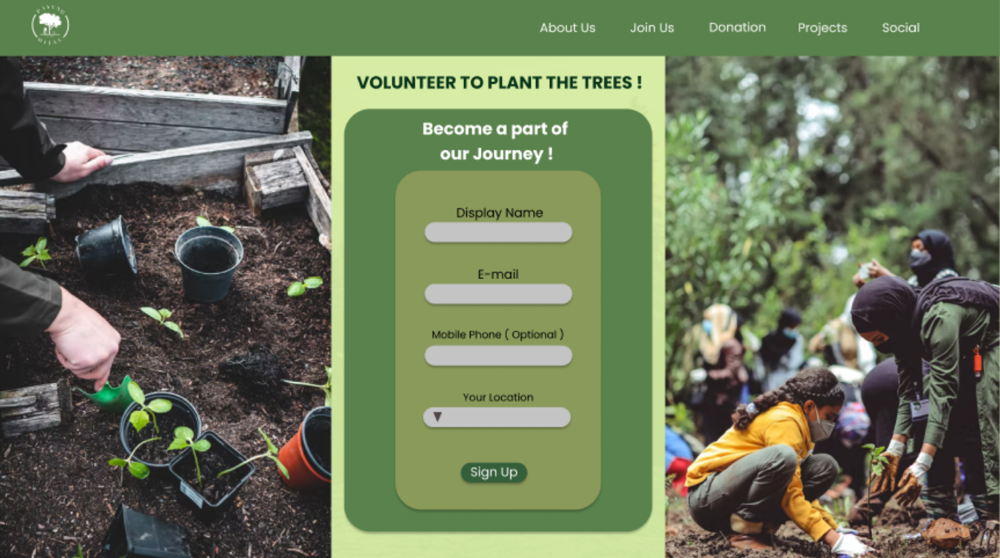
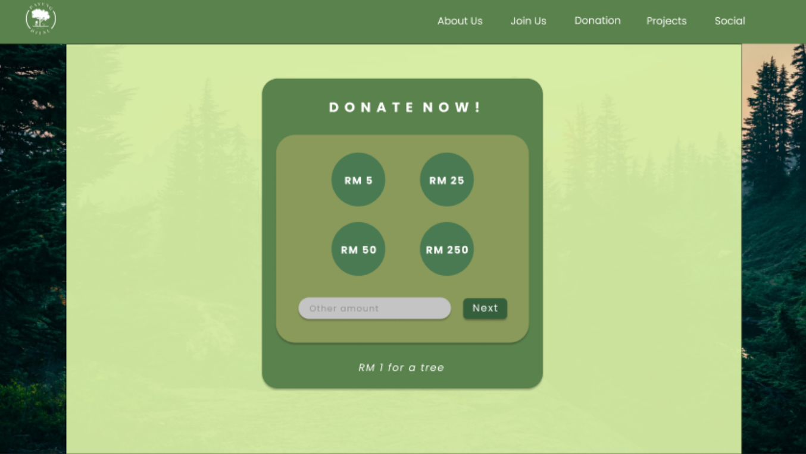
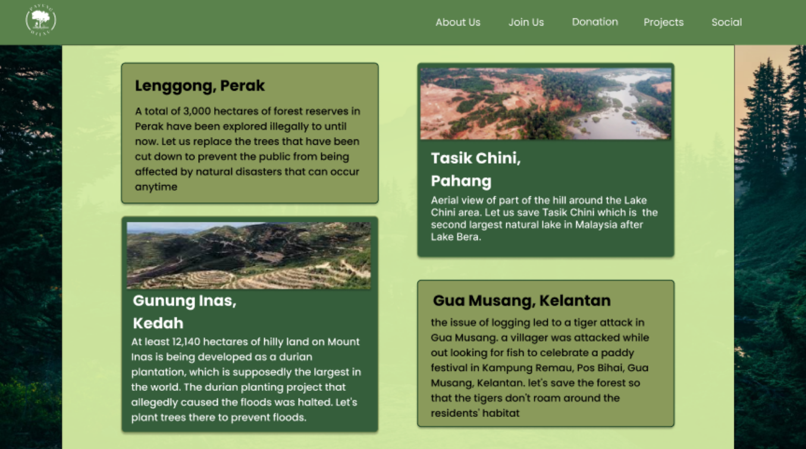
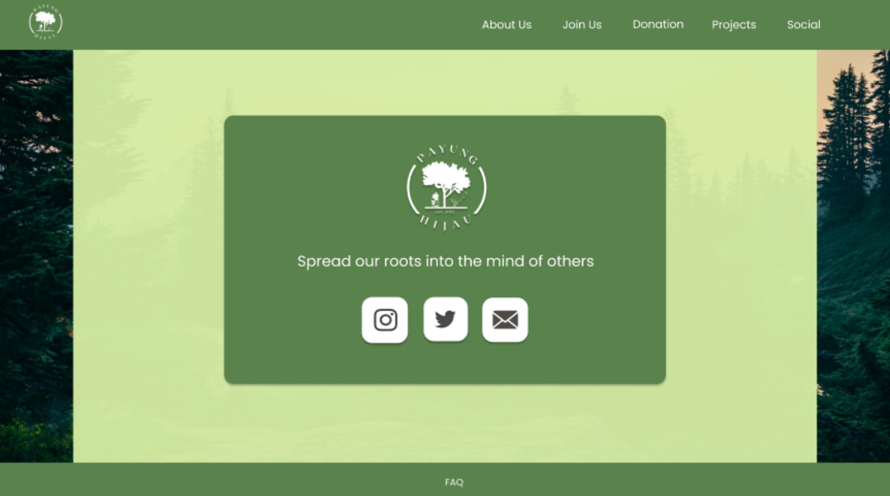

# Payung Hijau - First Website Project

**Payung Hijau** is a personal initiative I started to support environmental conservation efforts in Malaysia. As a non-profit concept project, the main mission of Payung Hijau is to **restore deforested and logged areas** across the country and raise awareness about the importance of protecting our biodiversity. This project is inspired by the **15th Sustainable Development Goal (SDG): Life On Land**, with a focus on safeguarding the remaining natural landscapes and wildlife of Malaysia.

---

## Project Purpose

With this project, I aim to:

- Highlight the ongoing issues related to deforestation, unsupervised development, and pollution.
- Educate the public on the impacts of habitat destruction through compelling digital storytelling.
- Provide a platform for **Malaysians to donate, volunteer, and share knowledge** about forest conservation.
- Promote small-scale community efforts that contribute to large-scale global impact.

---

## Tech Stacks Used

This project was developed using the following technologies:

 

- **HTML5** – Structure and layout of the website.
- **CSS3** – Styling and responsive design.
- **JavaScript** – Interactivity and dynamic page elements.

The goal was to build a minimalist yet functional website using core front-end technologies with no frameworks, as a way to sharpen my foundational skills.

---

## Personal Development

This project was built as part of my **personal upskilling journey**. I'm constantly exploring ways to improve my abilities in front-end web development, design thinking, and building purpose-driven platforms.

Payung Hijau allows me to:

- Practice clean code structure and responsive web design.
- Create real-world UI/UX aligned with a strong thematic message.
- Understand how to build a user-oriented website with forms, calls-to-action, and visual storytelling.

Ultimately, this is both a **portfolio project** and a **passion project**, combining my interests in tech, sustainability, and community impact.

---

## Website Overview

**Payung Hijau** is a minimalist and user-friendly website designed to promote community engagement through clear navigation and focused content. It consists of six main pages:

### Pages Overview

- **Home**  
  Displays the project's mission and current donation status to encourage community support.  

  

- **About Us**  
  Details the goals, ongoing activities, and motivations behind Payung Hijau.  

  

- **Join Us**  
  A form-based page for volunteers to sign up and get involved based on their location.  

  

- **Donation**  
  A secure and simple form that redirects donors to their preferred payment method.  

  

- **Projects**  
  Showcases reforestation efforts, awareness campaigns, and collaborations.  

  

- **Socials**  
  Aggregates content from social media platforms to amplify the cause and engage a broader audience.  

  


---

## Design & Aesthetics

- **Font**: Poppins for a modern and clean feel.
- **Color Palette**: Soothing tones of white, green, and brown to reflect the natural environment.
- **Backgrounds**: Calm and immersive visuals of lush forests and real volunteer efforts.

---

## Vision

> “A place to fund energy and money for the greater good.”

This project is my contribution to the conservation of Malaysian rainforests and the protection of native flora and fauna. I believe that change begins with individuals, and through this platform, I hope to inspire others to take part in preserving what’s left of our precious environment.

---

## Installation

1. Clone the repository:
   ```bash
   git clone https://github.com/AimanZaharin/PayungHijau-WebsiteProject.git
